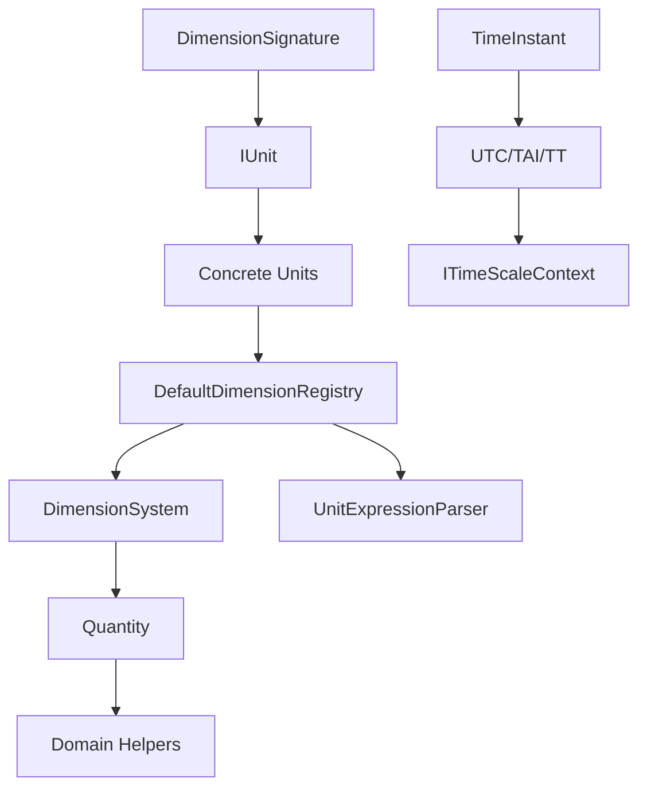

# Architecture

At a glance, SemanticQuantities consists of:
- Dimensions: `DimensionSignature` defines the vector of base exponents including Angle.
- Units: `IUnit` (`Name`, `Symbol`, `Signature`, `ToSI`, `FromSI`) with concrete classes for SI base, derived, accepted non-SI, and Imperial units. `CompoundUnit` represents canonical coherent compound units.
- Registry: `DefaultDimensionRegistry` implements `IDimensionRegistry`, providing `ParseUnit`, `GetCoherentUnit`, system inference, and canonical symbol fallback. `UnitExpressionParser` parses expressions like `m/s^2`.
- Quantities: `Quantity` is a runtime struct that stores its value in SI and carries a declared unit; it provides dimension-aware arithmetic and normalization via the registry. `DimensionSystem` exposes the active registry.
- Domain helpers: `Distance`, `Duration`, `Angle`, `Speed`, `Direction`, `Velocity`, `Mechanics` (`Mass`/`Acceleration`/`Force`) provide convenient factories and helpers.
- Time system: `TimeInstant<TScale>` represents an instant anchored in TAI seconds; scales (`UTC`/`TAI`/`TT`) convert via `ITimeScale` and an `ITimeScaleContext` which supplies leap seconds and other providers.

Registry behavior highlights:
- `ParseUnit` resolves by exact symbol (case-sensitive) or name (case-insensitive).
- `GetCoherentUnit` returns the preferred coherent unit for a signature in a given system; falls back to SI; if none found, it creates a canonical `CompoundUnit` symbol (e.g., `kg*m/s^2`).
- Mixed-system arithmetic (e.g., Imperial + SI) normalizes to SI by default.

See also: [[Overview]], [[Registry]], [[Quantities]]
